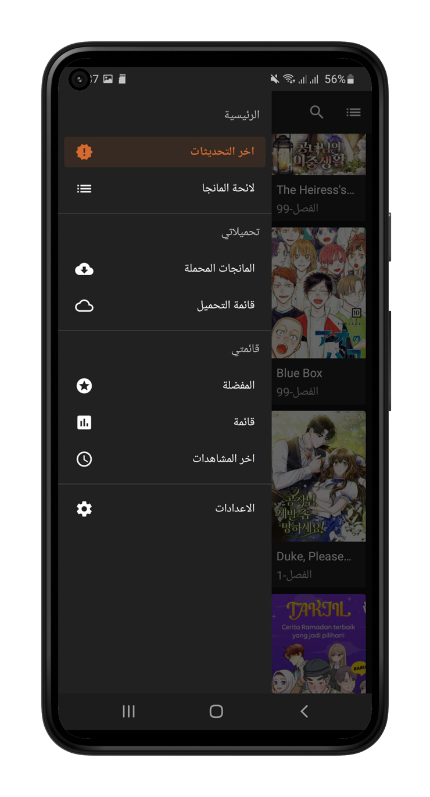
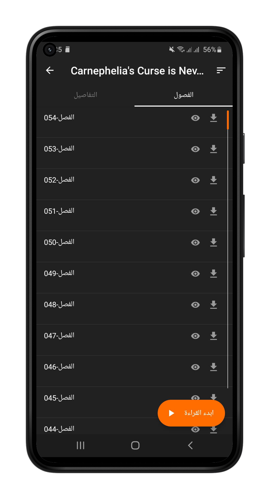

# Mlord

موقع مشروع **Mlord**، وهو تطبيق قارئ مانجا عربي بواجهة سهلة الاستخدام ومكتبة واسعة من العناوين.

## المزايا

- تصفح والبحث عن عناوين المانجا.
- قراءة الفصول بواجهة مريحة.
- حفظ العناوين المفضلة.
- تنقل سلس بين الفصول.
- دعم القراءة دون اتصال عند توفر نسخة التطبيق.

## لقطات الشاشة

## تحميل التطبيق

يمكن متابعة إصدارات **Mlord** من [صفحة الإصدارات في GitHub](https://github.com/lo-oord/Mlord/releases).

> ملاحظة: الأرشيف المرفق يحتوي على موقع الواجهة التعريفية فقط، وليس على مصدر Android الأصلي؛ لذلك لا توجد داخله ملفات Gradle أو AndroidManifest أو package name يمكن إعادة تسميتها فعليًا. تم تحديث جميع هوية الموقع والروابط المتاحة إلى Mlord.

## الترخيص والتنبيه

هذا المشروع واجهة تعريفية لمشروع قارئ مانجا، ولا يقدّم أي محتوى مانجا مضمّنًا داخل هذا المستودع.
